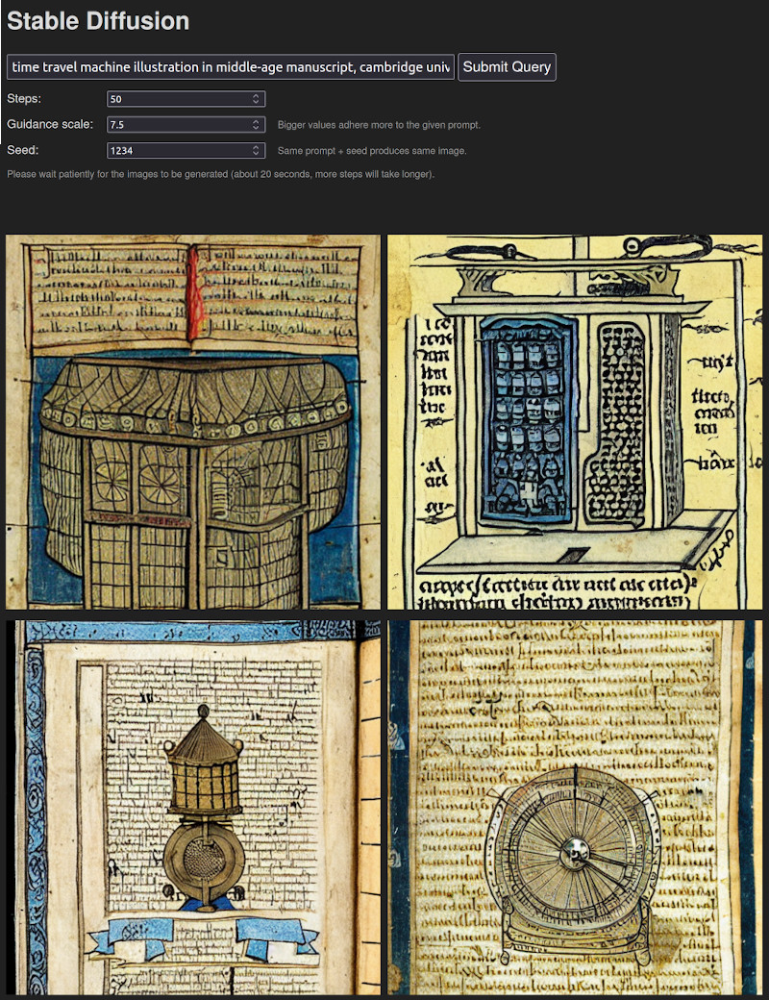

# Small web app around Hugging Face's Stable Diffusion



## Setup

```
virtualenv --system-site-packages venv
source venv/bin/activate
pip install transformers huggingface diffusers scipy flask ftfy
```

Make a token at Hugging Face: https://huggingface.co/settings/tokens

Login through the command-line:

```
huggingface-cli login
```

Paste the token when asked

## Running the webserver

```
python app.py
```

Doing this the first time will download the model. Please be patient.

## Prompt engineering 

The [MidJourney styles and keywords reference](https://github.com/willwulfken/MidJourney-Styles-and-Keywords-Reference/) is a useful guide in finding the right terms for promts.

Also check out the [DALL-E 2 prompt book](https://dallery.gallery/the-dalle-2-prompt-book/).

In general, start with the **image type**, e.g.: 
- "An image of"
- "A photograph of"
- "A headshot of"
- "A painting of"
- "A vision of"
- "A depiction of"
- "A cartoon of"
- "A drawing of"
- "A figure of"
- "An illustration of"
- "A sketch of"
- "A portrayal of"